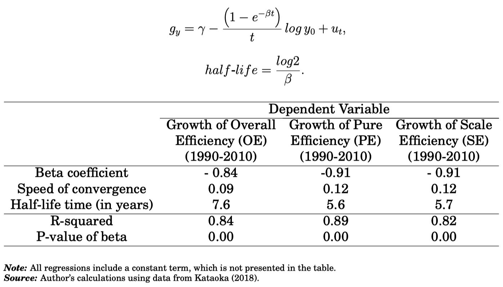
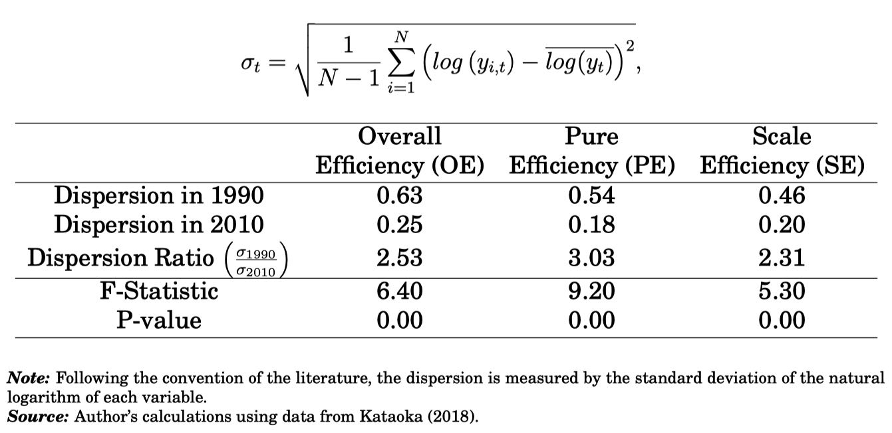
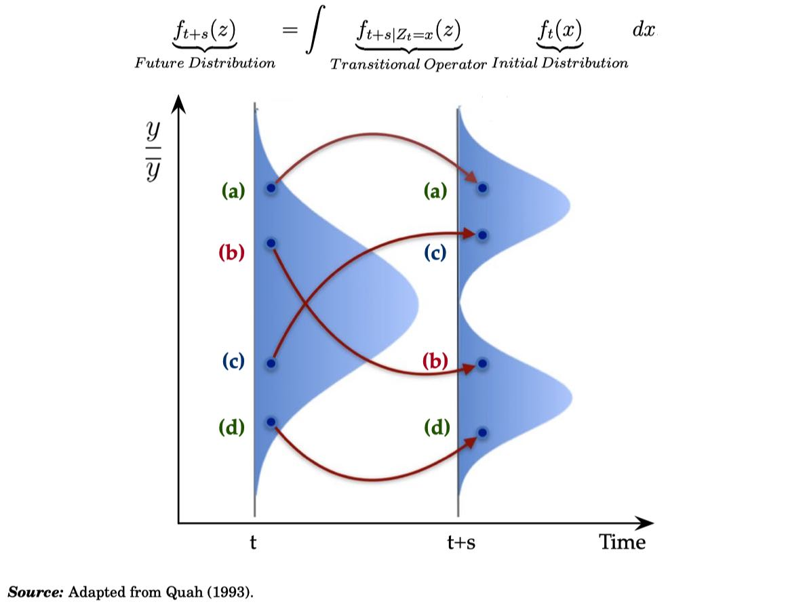
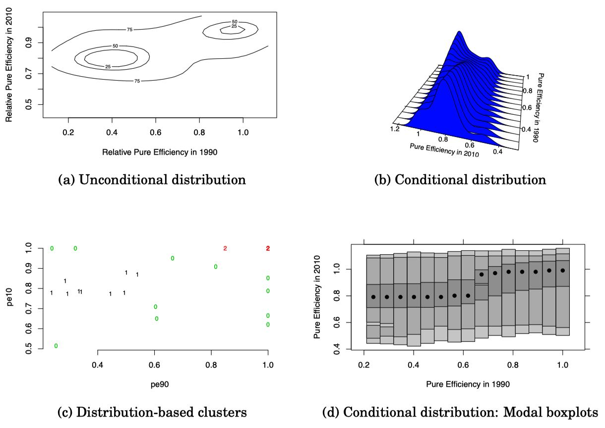
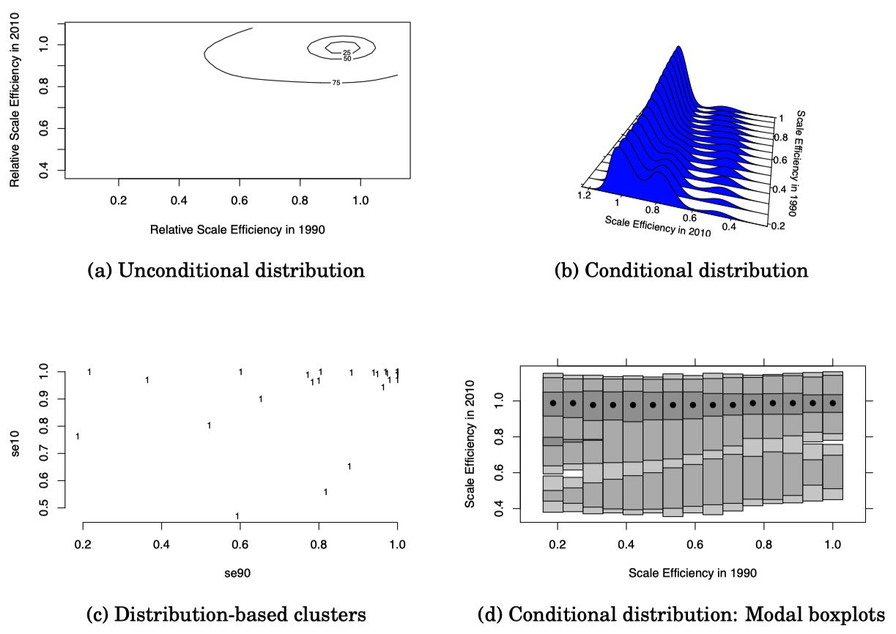
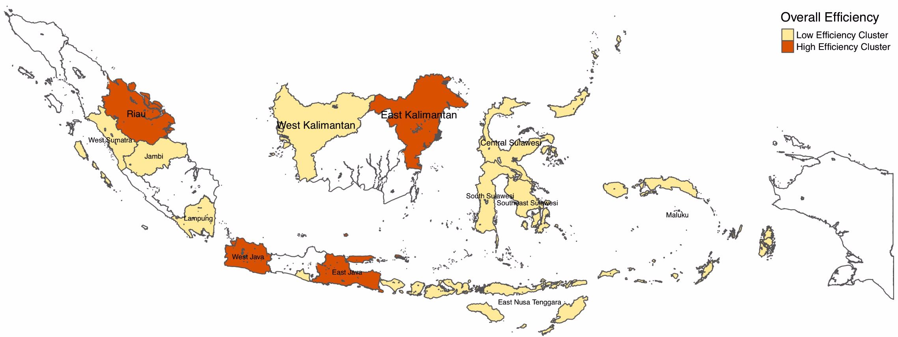
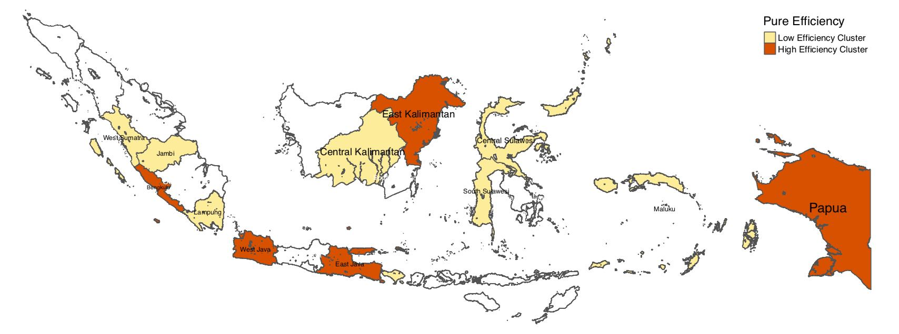

```{r setup, include=FALSE}
options(htmltools.dir.version = FALSE)
```


## Motivation:

- Economic convergence is important for regional cohesion and competitiveness

- Inconclusive literature about Latin America: Convergence vs Divergence vs Convergence Clubs (Galvao and Reis-Gomes, 2007; Barrios et. al, 2018; Martin and Vazquez, 2015)

- Development potential of Latin America constrained  by low productivity (Daude and Fernndez-Arias, 2010; Pages 2010; Restuccia, 2013)

  
## Research Objective:
  
- (Re)evaluate the convergence hypothesis across economies in Latin America with particular emphasis on productivity differences and the formation of multiple convergence clubs. 

  
## Methods:

- Nonlinear dynamic factor model  (Phillips and Sul, 2007, 2009)

- Clustering algorithm for panel data (Phillips and Sul, 2007, 2009)

## Data:

- Labor productivity and total factor productivity (Fernandez-Arias, 2017)

- 20 Latin American countries over the 1980-2014 period 


---

class: middle

## Main Results:

1. **Lack of overall convergence** in both labor productivity and total factor productivity

2. Regional heterogeneity matters: **Multiple local convergence clubs**

3. **Covergence clubs characteristics:** 

  - Labor productivity: **Four clubs** of countries
  - Total factor productivity: **Three clubs** of countries
  - The lowest-productivity club (Honduras and Nicaragua) is diverging from the rest **at the highest speed**.

**Implication**: Pockets of heterogeneity (convergence clubs) need to be addressed to improve economic cohesion and competitiveness in Latin America.

---

class: middle

# Outline of this presentation

1. **Global convergence "on average":** Using classical summary measures

  - Beta convergence
  - Sigma convergence

2. **Let's go beyond the average:** Regional heterogeneity still matters

  - Distribution dynamics framework
  - Distributional convergence

3. **Local convergence clusters:**

  - Overall efficiency: Two convergence clusters
  - Pure technical efficiency: Two convergence clusters
  - Scale efficiency: One convergence cluster

---

class: center, middle

# (1) Global convergence "on average"
**Using classical summary measures**

Beta convergence

Sigma convergence

---

class: middle,center

## Beta convergence



---

class: middle, center

## Sigma convergence



---

class: center, middle

# (2) Let's go beyond the average
**Regional heterogeneity still matters**

Distribution dynamics framework

Distributional convergence


---
class: middle

# Regional heterogeneity matters

- Let's GO beyond the average! 

- Study the dynamics of the **entire regional distribution**

    - Let's move from **conditional mean** to **conditional density** estimation.
    - Recent advances in nonparametric econometrics: **Distribution dynamics**

---
class: middle, center

## The distribution dynamics framework



---
class: middle, center

# (3) Local convergence clusters

**Overall efficiency = Pure technical efficiency x Scale efficiency**

Overall efficiency: Two convergence clusters

Pure technical efficiency: Two convergence clusters

Scale efficiency: One convergence cluster

---
class: middle, center

## Overall efficiency: Two convergence clusters


---
class: middle, center

## Pure technical efficiency: Two convergence clusters




---
class: middle, center

## Scale efficiency: One convergence cluster




---
class: middle, center

## Spatial distribution of overall efficiency clusters




---
class: middle, center

## Spatial distribution of pure efficiency clusters



---

# Concluding Remarks

## A happy ending "on average" :

- Differences in overall efficiency and its two determinants (pure technical efficiency and scale efficiency) have decreased over the 1990-2010 period. 

- Global convergence on average

## Focus beyond the average :

- Regional differences are still important

- Multiple local convergence clubs:
  - Overall efficiency: Two convergence clusters
  - Pure technical efficiency: Two convergence clusters
  - Scale efficiency: One convergence cluster

## Implications and further research

- Convergence clusters help us identify regions facing similar challenges
- Call for better coordination of regional policies at the cluster level
- What is the role of geographical neighbors in accelerating  convergence?
- What alternative clustering frameworks could be implemented?


---

class: center, middle

# Thank you very much for your attention

https://carlos-mendez.rbind.io

Slides and working paper available at: http://bit.ly/jasid2019 


**Quantiative Regional and Computational Science lab**

https://quarcs-lab.rbind.io/

***

This research project was supported by JSPS KAKENHI Grant Number 	19K13669 

